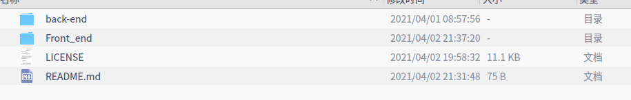
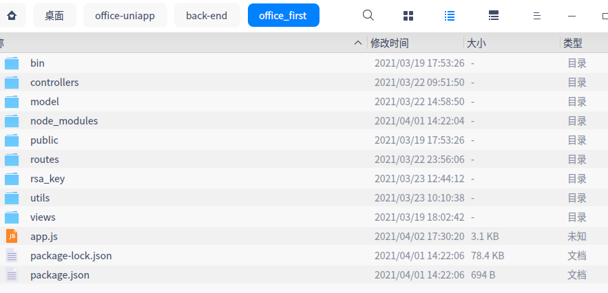
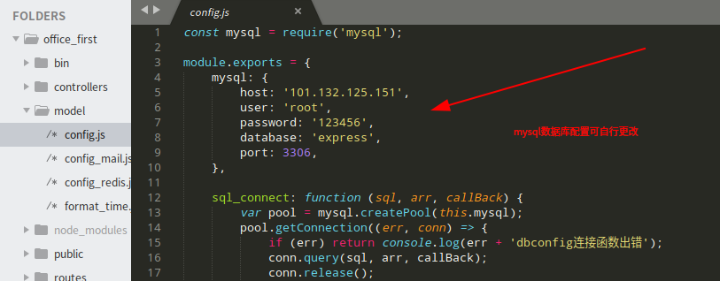
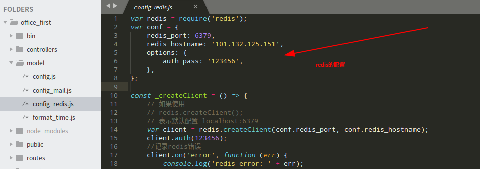
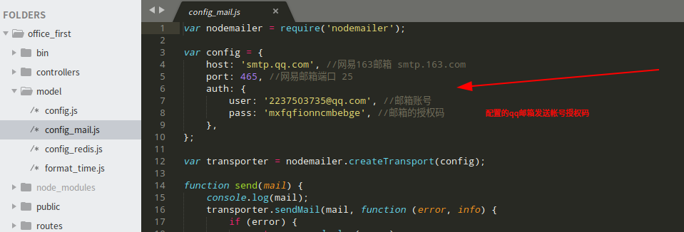
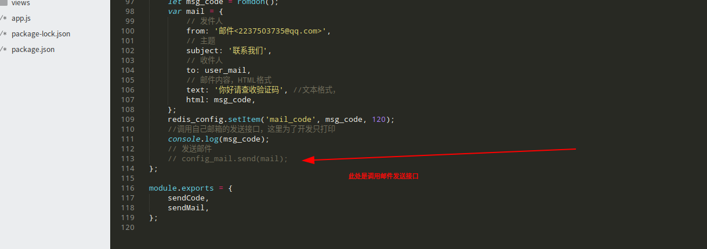
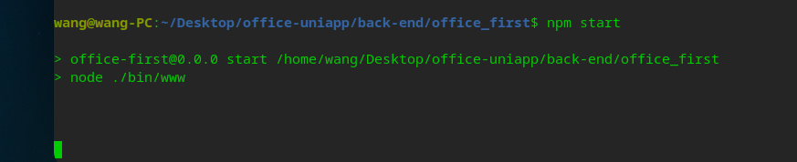

# office-uniapp
Office small program based on uniapp

<h3>使用参考</h3>

​	

Front_end为项目前端也就是基于uniapp开发，back-end为后端进入back-end目录会有office_first项目目录，项目使用node-express+mysql+redis实现，下面讲一下后端项目的配置



mysql和redis数据库配置更改参考如下两张图





下面讲一下qq邮箱发送的帐号配置，如下图更改为自己的邮箱和授权码，邮箱授权码开通可以参考此链接

https://blog.csdn.net/gggingsss/article/details/82626744



邮箱发送接口默认注释的，可自行打开



到项目根路径下输入

```node
npm start
```

运行项目，如遇到缺少安装包报错可运行

```node
npm install --save
```

出现如下图的信息说明node项目运行成功

​	

前端uniapp项目配置运行参考官网https://uniapp.dcloud.io/