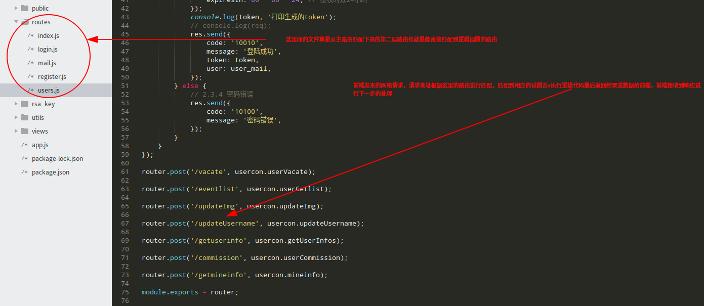

# office-uniapp
Office small program based on uniapp

<h3>使用参考</h3>

​	

Front_end为项目前端也就是基于uniapp开发，back-end为后端进入back-end目录会有office_first项目目录，项目使用node-express+mysql+redis实现，下面讲一下后端项目的配置


mysql和redis数据库配置更改参考如下两张图


下面讲一下qq邮箱发送的帐号配置，如下图更改为自己的邮箱和授权码，邮箱授权码开通可以参考此链接

https://blog.csdn.net/gggingsss/article/details/82626744


邮箱发送接口默认注释的，可自行打开


app.js文件是项目配置主路由以及包含了登陆校验，主路由是前端发送的网络请求地址所进行第一次校验匹配，匹配到主路由进行第二次路由匹配也就是视图路由，然后匹配到相应的视图逻辑代码执行返回结果或数据给前端，这也是

前端发送请求-》后端接收这个请求地址进行路由匹配 -》执行视图代码 -》最后返回结果


jwt.js文件,JSON Web Token (JWT)是一个开放标准(RFC 7519)，它定义了一种紧凑的、自包含的方式，用于作为JSON对象在各方之间安全地传输信息。该信息可以被验证和信任，因为它是数字签名的。JWT的声明一般被用来在身份提供者和服务提供者间传递被认证的用户身份信息，以便于从资源服务器获取资源，也可以增加一些额外的其它业务逻辑所必须的声明信息，该token也可直接被用于认证，也可被加密。此文档主要用于用户登陆时生成token.


rsa_key文件是用于生成token的密钥，public是公钥用于生成token,private是私密钥用于验证token


route文件主要存放的是视图路由，也就是前端发送网络请求第二次匹配的路由，可以根据前端的网络请求地址匹配到路由然后理解里面的视图代码这里大致说明下，index.js和login用于项目测试（这里请忽视）

vacate:请假的视图

eventlist:代办事项

updateimg:修改头像

updateusername:修改用户名

commission: 发起代办

getmineinfo:我的页面获取用户的信息

register:封装了注册的视图逻辑

mail:封装发送qq邮箱验证码接口



controllers文件下面的usercontroller存放了大部分的视图代码，mailcontriller封装了qq邮箱发送模块，catecontroller在此项目中仅作测试（请忽视）


到项目根路径下输入

```node
npm start
```

运行项目，如遇到缺少安装包报错可运行

```node
npm install --save
```

出现如下图的信息说明node项目运行成功

​	

前端uniapp项目配置运行参考官网https://uniapp.dcloud.io/